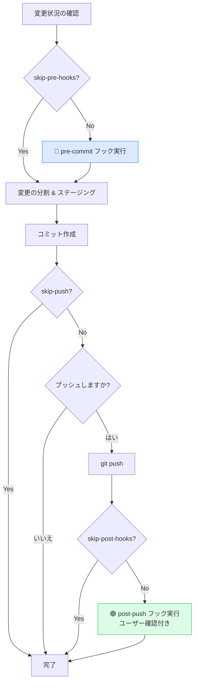
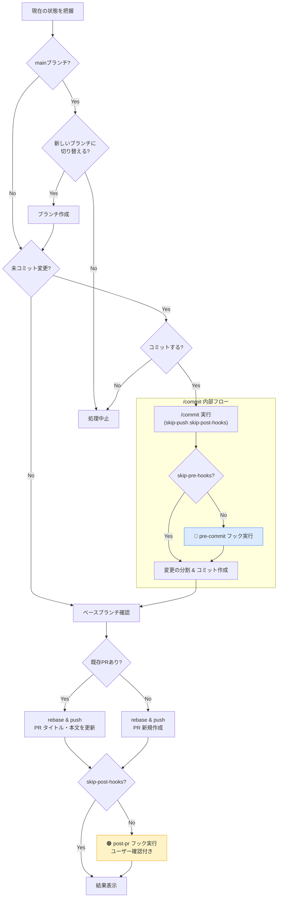

# git-workflow plugin

Claude Code 用の git ワークフロー自動化プラグイン。

## コマンド

| コマンド | 説明 |
|---------|------|
| `/commit` | Conventional Commits 形式でコミットを作成。プッシュ・ライフサイクルフックに対応 |
| `/create-pr` | GitHub PR の作成・更新。自動 rebase、差分分析、ライフサイクルフックに対応 |
| `/sync-main` | main に切り替えて最新化し、リモートで削除済みのローカルブランチをクリーンアップ |
| `/setup-hooks` | `.claude/skill-hooks.md` を対話的に生成・編集。スキルの自動検出とプレビュー付き |

## ライフサイクルフック

プロジェクト固有の拡張を **スキルフック** 設定ファイルで定義できる。プロジェクトルートに `.claude/skill-hooks.md` を作成してフックとスキルを紐付ける。

### フロー図

#### `/commit` のフロー



#### `/create-pr` のフロー



#### フックの凡例

| 色 | フック | タイミング |
|----|--------|-----------|
| 🔵 青 | `pre-commit` | コミット前に自動実行 |
| 🟢 緑 | `post-push` | プッシュ後にユーザー確認付きで実行 |
| 🟠 橙 | `post-pr` | PR作成・更新後にユーザー確認付きで実行 |

### フックの書式

プロジェクトルートに `.claude/skill-hooks.md` を以下の形式で作成する。各コマンドごとにセクションを設け、フックポイントにスキルを紐付ける。

```markdown
# Skill Hooks

## commit

| フック | スキル | 説明 |
|-------|-------|------|
| pre-commit | your-skill | コミット前に実行（例: ドキュメント更新、リント） |
| post-push | your-skill | プッシュ後にユーザー確認付きで実行（質問: "...", 選択肢: ["...", "..."]） |

## create-pr

| フック | スキル | 説明 |
|-------|-------|------|
| pre-commit | your-skill | PR 作成時のコミット前に実行（`/commit` の pre-commit と共通） |
| post-pr | your-skill | PR 作成・更新後にユーザー確認付きで実行（質問: "...", 選択肢: ["...", "..."]） |
```

- **pre フック**（`pre-commit`）: 自動実行される。`/create-pr` 経由でも実行される
- **post フック**（`post-push`, `post-pr`）: 「説明」列の質問文と選択肢でユーザーに確認してから実行される
- `skip-pre-hooks` / `skip-post-hooks` 引数で個別にスキップ可能

### 利用可能なフック

| コマンド | フック | タイミング | スキップ引数 |
|---------|-------|-----------|-------------|
| `/commit` | `pre-commit` | ステータス確認後、ステージング前 | `skip-pre-hooks` |
| `/commit` | `post-push` | プッシュ後（ユーザー確認付き） | `skip-post-hooks` |
| `/create-pr` | `pre-commit` | 未コミット変更のコミット時（`/commit` 経由） | `skip-pre-hooks` |
| `/create-pr` | `post-pr` | PR 作成・更新後（ユーザー確認付き） | `skip-post-hooks` |

`.claude/skill-hooks.md` が存在しない場合やフックが未定義の場合はスキップされる。

## コマンドの引数

### `/commit`

| 引数 | 効果 |
|------|------|
| `skip-pre-hooks` | pre-commit フックをスキップ |
| `skip-post-hooks` | post-push フックをスキップ |
| `skip-push` | プッシュ確認ステップをスキップ |

他のコマンド（例: `/deploy`）から `/commit skip-push skip-pre-hooks skip-post-hooks` を呼び出すことで、コアのコミット処理のみを実行できる。

### `/create-pr`

| 引数 | 効果 |
|------|------|
| `skip-pre-hooks` | 内部 commit の pre-commit フックをスキップ |
| `skip-post-hooks` | 内部 commit の post-push フックおよび create-pr の post-pr フックをスキップ |

デフォルトでは `/create-pr` 経由でも pre-commit フックが実行される。

## インストール

```bash
# 1. マーケットプレイスを追加
/plugin marketplace add yoshiyasuko/claude-code-git-workflow-plugins

# 2. プラグインをインストール
/plugin install git-workflow@git-workflow-plugins
```

### ローカル開発

```bash
# リポジトリをクローンしてローカルマーケットプレイスとして追加
git clone git@github.com:yoshiyasuko/claude-code-git-workflow-plugins.git
cd claude-code-git-workflow-plugins
/plugin marketplace add ./
/plugin install git-workflow@git-workflow-plugins
```

## 使用例: GAS プロジェクトのフック

```markdown
# Skill Hooks

## commit

| フック | スキル | 説明 |
|-------|-------|------|
| pre-commit | update-docs | コミット前にドキュメント更新チェックを実行 |
| post-push | deploy | プッシュ後にデプロイするか確認（質問: 「デプロイしますか？」、選択肢: ["デプロイする", "スキップ"]） |

## create-pr

| フック | スキル | 説明 |
|-------|-------|------|
| post-pr | preview-deploy | PR作成/更新後にプレビューデプロイするか確認（質問: 「プレビューデプロイしますか？」、選択肢: ["デプロイする", "スキップ"]） |
```
