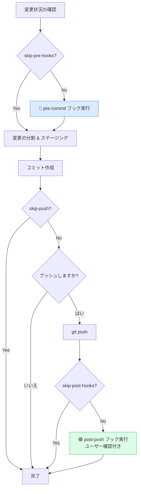

# `/commit` のフロー

```mermaid
flowchart TD
    A[変更状況の確認] --> B{skip-pre-hooks?}
    B -- No --> C[🔵 pre-commit フック実行]
    B -- Yes --> D
    C --> D[変更の分割 & ステージング]
    D --> E[コミット作成]
    E --> F{skip-push?}
    F -- No --> G{プッシュしますか?}
    F -- Yes --> END[完了]
    G -- はい --> H[git push]
    G -- いいえ --> END
    H --> I{skip-post-hooks?}
    I -- No --> J[🟢 post-push フック実行<br/>ユーザー確認付き]
    I -- Yes --> END
    J --> END

    style C fill:#dbeafe,stroke:#3b82f6
    style J fill:#dcfce7,stroke:#22c55e
```

## フックの凡例

| 色 | フック | タイミング |
|----|--------|-----------|
| 🔵 青 | `pre-commit` | コミット前に自動実行 |
| 🟢 緑 | `post-push` | プッシュ後にユーザー確認付きで実行 |
