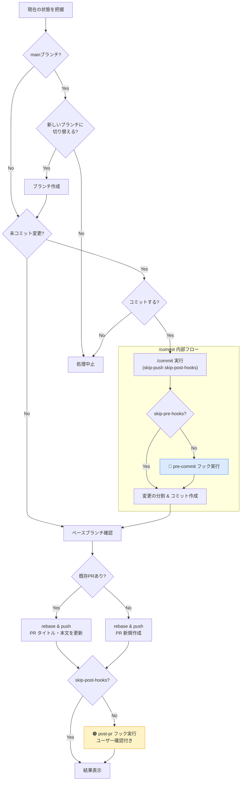

# `/create-pr` のフロー

```mermaid
flowchart TD
    A[現在の状態を把握] --> B{mainブランチ?}
    B -- Yes --> C{新しいブランチに<br/>切り替える?}
    B -- No --> D
    C -- Yes --> C2[ブランチ作成] --> D
    C -- No --> ABORT[処理中止]
    D{未コミット変更?}
    D -- Yes --> E{コミットする?}
    D -- No --> G
    E -- Yes --> F["/commit 実行<br/>(skip-push skip-post-hooks)"]
    E -- No --> ABORT

    subgraph commit ["/commit 内部フロー"]
        F --> F1{skip-pre-hooks?}
        F1 -- No --> F2[🔵 pre-commit フック実行]
        F1 -- Yes --> F3
        F2 --> F3[変更の分割 & コミット作成]
    end

    F3 --> G[ベースブランチ確認]
    G --> H{既存PRあり?}
    H -- Yes --> I[rebase & push<br/>PR タイトル・本文を更新]
    H -- No --> J[rebase & push<br/>PR 新規作成]
    I --> K{skip-post-hooks?}
    J --> K
    K -- No --> L[🟠 post-pr フック実行<br/>ユーザー確認付き]
    K -- Yes --> END[結果表示]
    L --> END

    style F2 fill:#dbeafe,stroke:#3b82f6
    style L fill:#fef3c7,stroke:#f59e0b
```

## フックの凡例

| 色 | フック | タイミング |
|----|--------|-----------|
| 🔵 青 | `pre-commit` | コミット前に自動実行（`/commit` の pre-commit と共通） |
| 🟠 橙 | `post-pr` | PR作成・更新後にユーザー確認付きで実行 |
