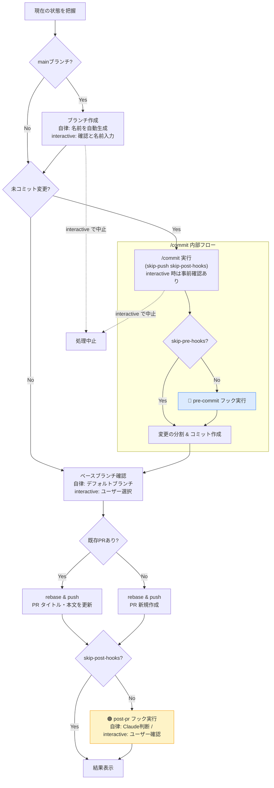

# `/create-pr` のフロー

デフォルトは自律モード。`interactive` 引数を付けた場合のみ、ブランチ作成・コミット・ベースブランチ選択・post-pr フック実行の各ポイントでユーザー確認が入る（`interactive` は内部の `/commit` 呼び出しにも転送される）。

## フックの凡例

| 色 | フック | タイミング |
|----|--------|-----------|
| 🔵 青 | `pre-commit` | コミット前に自動実行（`/commit` の pre-commit と共通） |
| 🟠 橙 | `post-pr` | PR作成・更新後に実行（自律モードでは Claude が実行要否を判断、`interactive` 時はユーザー確認付き） |
